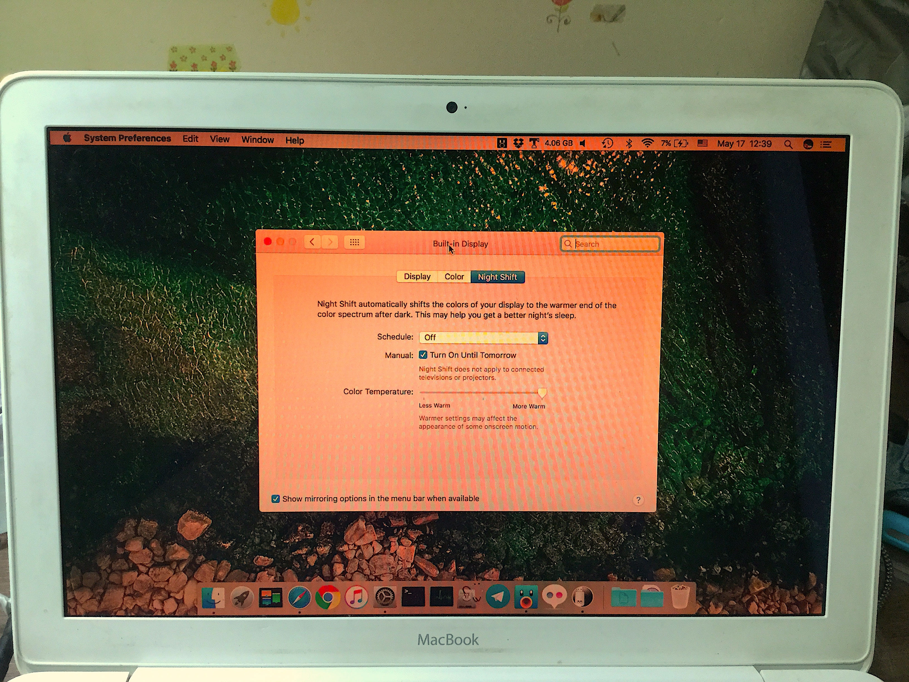

# NightPatch

Enable Night Shift on any old Mac models.

You have to disable SIP (System Integrity Protection) before applying. [How to disable SIP](http://apple.stackexchange.com/a/209530)

Backup your Mac before applying.

Not compatible with some third-party monitors. This is a solution for unsupported Mac, not unsupported monitors!

## Supported macOS

macOS 10.12.4 or later including High Sierra. ([List of tested macOS build](docs/list.md))

About 10.13.4 (17E199) and 10.13.5 (17F35e) - 10.13.4 (17E199) and 10.13.5 (17F35e) work well for me but [some people undergo unbootable issue](https://github.com/pookjw/NightPatch/issues/5).

## How to patch

Enter this command on Terminal **without $**.

`$ cd /tmp; curl -s -o NightPatch.zip https://codeload.github.com/pookjw/NightPatch/zip/master; unzip -o -qq NightPatch.zip; cd NightPatch-master; chmod +x NightPatch.sh; sudo ./NightPatch.sh`

## How to revert using backup

You can revert using backup located on /Library/NightPatch. (NightPatch creates backup automatically when you patch your macOS) Enter this command on Terminal **without $**.

`$ cd /tmp; curl -s -o NightPatch.zip https://codeload.github.com/pookjw/NightPatch/zip/master; unzip -o -qq NightPatch.zip; cd NightPatch-master; chmod +x NightPatch.sh; sudo ./NightPatch.sh --revert`

## How to revert using macOS combo Update

If you deleted backup (or not backed up with NightPatch), enter this command on Terminal **without $**. NightPatch will download original system file from Apple. This method works without backup.

`$ cd /tmp; curl -s -o NightPatch.zip https://codeload.github.com/pookjw/NightPatch/zip/master; unzip -o -qq NightPatch.zip; cd NightPatch-master; chmod +x NightPatch.sh; sudo ./NightPatch.sh --fix`

## How to run beta build

Enter this command on Terminal **without $**.

`$ cd /tmp; curl -s -o NightPatch.zip https://codeload.github.com/pookjw/NightPatch/zip/master; unzip -o -qq NightPatch.zip; cd NightPatch-master; chmod +x NightPatch.sh; sudo ./NightPatch-beta.sh`

- [Stable](https://github.com/pookjw/NightPatch/blob/master/NightPatch.sh) : Version 246

- [Beta](https://github.com/pookjw/NightPatch/blob/master/NightPatch-beta.sh) : Version 247 (changelog: [247](https://github.com/pookjw/NightPatch/commit/31e078eba8bd7bb437d7ef54c8e16c1b79631631))

If you want to revert using backup, use `--revert`. Also using macOS combo Update is `--fix`.

## Troubleshootings

- ERROR : Turn off System Integrity Protection before doing this.

: [Solution](http://apple.stackexchange.com/a/209530)

- 'Password:' ???

: Enter your login password.

- NightPatch repeatedly requires password.

: Update to latest macOS to solve this, or run NightPatch with `sudo su`.

- xcrun error

: Try `xcode-select --install` command.

## References

[aonez/NightShiftPatcher](https://github.com/aonez/NightShiftPatcher)

[Supported Mac models for Night Shift in Sierra 10.12.4+](https://pikeralpha.wordpress.com/2017/01/30/4398/)

[Supported Mac models for Night Shift in High Sierra 10.13.2](https://pikeralpha.wordpress.com/2017/11/06/supported-mac-models-for-night-shift-in-high-sierra-10-13-2/)

